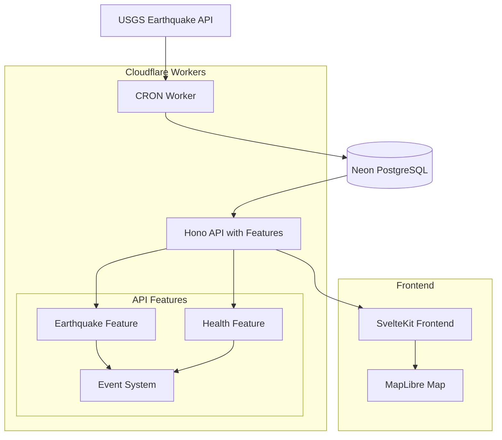

# 🗂 Project Architecture

## Monorepo Structure

```
quake-map/
├─ apps/
│  ├─ web/           # SvelteKit frontend application
│  │  ├─ src/
│  │  │  ├─ lib/     # Components, stores, utilities
│  │  │  ├─ routes/  # SvelteKit pages and API routes
│  │  │  └─ app.html # Main HTML template
│  │  ├─ static/     # Static assets
│  │  └─ package.json
│  └─ api/           # Hono backend (Cloudflare Worker)
│     ├─ src/
│     │  ├─ features/     # Feature-based architecture
│     │  │  ├─ earthquake/ # Earthquake data management
│     │  │  │  ├─ endpoints/    # API route handlers
│     │  │  │  ├─ queries/      # Database queries
│     │  │  │  ├─ models/       # Type definitions & schemas
│     │  │  │  └─ events/       # Event listeners
│     │  │  ├─ health/     # Health check feature
│     │  │  └─ shared/     # Shared feature components
│     │  ├─ middleware/    # Database & other middleware
│     │  ├─ routes/        # Legacy API routes (backward compatibility)
│     │  ├─ schemas/       # Zod validation schemas
│     │  ├─ events.ts      # Event system types
│     │  ├─ types.ts       # TypeScript type definitions
│     │  └─ index.ts       # Worker entry point
│     └─ package.json
├─ packages/
│  ├─ db/            # Database layer
│  │  ├─ schema/     # Drizzle schema definitions
│  │  ├─ migrations/ # Database migrations
│  │  └─ client.ts   # Neon client configuration
│  ├─ ui/            # Shared UI components
│  │  ├─ components/ # Reusable Svelte components
│  │  └─ styles/     # Shared CSS/Tailwind styles
│  └─ config/        # Shared configurations
│     ├─ eslint/     # ESLint configurations
│     ├─ typescript/ # TypeScript configurations
│     └─ tailwind/   # Tailwind CSS configurations
├─ turbo.json        # Turborepo configuration
├─ package.json      # Root package.json
└─ pnpm-workspace.yaml
```

## Technology Stack

- **Runtime**: Node.js 18+ with TypeScript
- **Package Manager**: pnpm with workspaces
- **Build System**: Turborepo for monorepo management
- **Frontend**: SvelteKit + Tailwind CSS + MapLibre GL JS
- **Backend**: Hono.js + Cloudflare Workers
- **Database**: Neon PostgreSQL + Drizzle ORM
- **Deployment**: Cloudflare Workers + Vercel/Netlify

## System Architecture

### Feature-Based Architecture

The API follows a feature-based architecture pattern that promotes modularity, maintainability, and scalability:

#### Core Principles
- **Self-contained Features**: Each feature contains all its dependencies (endpoints, queries, models, events)
- **Event-Driven Communication**: Features communicate through a centralized event system
- **Per-Request Database Connections**: Optimized for Cloudflare Workers serverless environment
- **Type Safety**: Full TypeScript integration with Zod validation

#### Feature Structure
```
src/features/
├─ earthquake/          # Earthquake data management
│  ├─ endpoints/        # API route handlers
│  │  ├─ earthquakes.get.ts
│  │  ├─ earthquake.get.ts
│  │  └─ earthquake-stats.get.ts
│  ├─ queries/          # Database operations
│  │  └─ earthquake.queries.ts
│  ├─ models/           # Type definitions & schemas
│  │  ├─ earthquake.type.ts
│  │  └─ earthquake.schema.ts
│  ├─ events/           # Event listeners
│  │  └─ listeners.ts
│  └─ bootstrap.ts      # Feature initialization
├─ health/              # Health check feature
│  ├─ endpoints/
│  │  └─ health.get.ts
│  └─ bootstrap.ts
└─ shared/              # Shared components
   └─ models/           # Common response schemas
```

#### Event System
- **Centralized Event Bus**: Mock event emitter for decoupled communication
- **Event Types**: `data:ingested`, `stats:updated`, `earthquake:created`
- **Listeners**: Feature-specific event handlers for cross-cutting concerns

### Data Flow
1. **Data Ingestion**: USGS API → CRON Worker → Neon Database
2. **API Layer**: Hono.js → Feature Endpoints → Database Queries
3. **Frontend**: SvelteKit → API Calls → MapLibre Visualization
4. **Real-time Updates**: Event System → State Management → UI Updates

### Component Interactions



## Package Dependencies

### Root Package
- Turborepo for build orchestration
- pnpm for package management
- Shared TypeScript configurations
- ESLint and Prettier configurations

### Apps/Web (Frontend)
- SvelteKit for application framework
- Tailwind CSS for styling
- MapLibre GL JS for map visualization
- Shared UI components from packages/ui

### Apps/API (Backend)
- **Hono.js** for API framework with OpenAPI support
- **Drizzle ORM** for database operations with Neon PostgreSQL
- **Zod** for schema validation and type safety
- **Feature-based architecture** for modular development
- **Event-driven system** for decoupled communication
- **Per-request database connections** optimized for Cloudflare Workers
- **OpenAPI/Swagger UI** for API documentation
- Shared database schema from packages/db
- Cloudflare Workers runtime

### Packages/DB
- **Drizzle ORM v0.32.0** for type-safe database operations
- **PostgreSQL driver** with Neon compatibility
- **Schema definitions** with comprehensive earthquake data model
- **Database migrations** for schema versioning
- **Connection utilities** optimized for serverless environments

### Packages/UI
- Svelte components
- Tailwind CSS configurations
- Shared design system
- Icon libraries

### Packages/Config
- TypeScript configurations
- ESLint rules and plugins
- Prettier configurations
- Build tool configurations

## Environment Configuration

### Development Environment
- Local development servers
- Hot reload for frontend and backend
- Database connection to Neon staging
- Mock data for testing

### Production Environment
- Cloudflare Workers deployment
- Vercel/Netlify frontend deployment
- Production Neon database
- CDN for static assets

## Security Considerations

- Environment variables for sensitive data
- CORS configuration for API endpoints
- Rate limiting on API routes
- Input validation and sanitization
- HTTPS enforcement in production

## Performance Optimizations

- Database query optimization with indexes
- CDN caching for static assets
- Map rendering optimization
- Client-side caching strategies
- Lazy loading for map components
