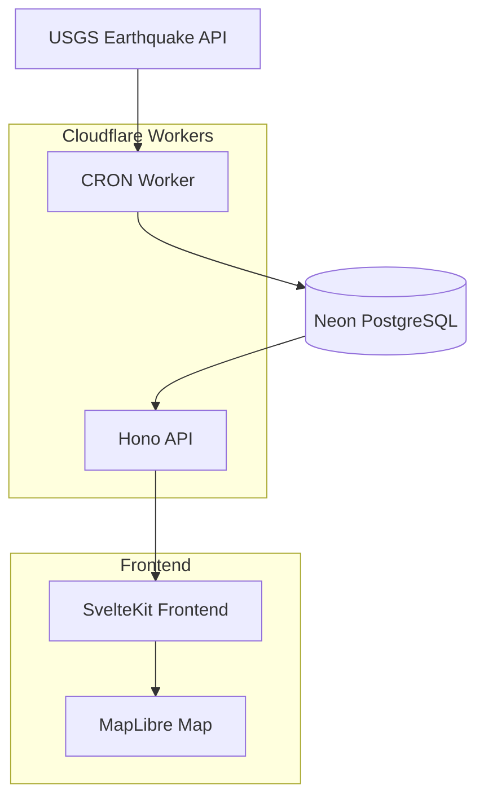

# 🗂 Project Architecture

## Monorepo Structure

```
quake-map/
├─ apps/
│  ├─ web/           # SvelteKit frontend application
│  │  ├─ src/
│  │  │  ├─ lib/     # Components, stores, utilities
│  │  │  ├─ routes/  # SvelteKit pages and API routes
│  │  │  └─ app.html # Main HTML template
│  │  ├─ static/     # Static assets
│  │  └─ package.json
│  └─ api/           # Hono backend (Cloudflare Worker)
│     ├─ src/
│     │  ├─ routes/  # API endpoints
│     │  ├─ workers/ # CRON jobs and background tasks
│     │  └─ index.ts # Worker entry point
│     └─ package.json
├─ packages/
│  ├─ db/            # Database layer
│  │  ├─ schema/     # Drizzle schema definitions
│  │  ├─ migrations/ # Database migrations
│  │  └─ client.ts   # Neon client configuration
│  ├─ ui/            # Shared UI components
│  │  ├─ components/ # Reusable Svelte components
│  │  └─ styles/     # Shared CSS/Tailwind styles
│  └─ config/        # Shared configurations
│     ├─ eslint/     # ESLint configurations
│     ├─ typescript/ # TypeScript configurations
│     └─ tailwind/   # Tailwind CSS configurations
├─ turbo.json        # Turborepo configuration
├─ package.json      # Root package.json
└─ pnpm-workspace.yaml
```

## Technology Stack

- **Runtime**: Node.js 18+ with TypeScript
- **Package Manager**: pnpm with workspaces
- **Build System**: Turborepo for monorepo management
- **Frontend**: SvelteKit + Tailwind CSS + MapLibre GL JS
- **Backend**: Hono.js + Cloudflare Workers
- **Database**: Neon PostgreSQL + Drizzle ORM
- **Deployment**: Cloudflare Workers + Vercel/Netlify

## System Architecture

### Data Flow
1. **Data Ingestion**: USGS API → CRON Worker → Neon Database
2. **API Layer**: Hono.js → Cloudflare Workers → Database Queries
3. **Frontend**: SvelteKit → API Calls → MapLibre Visualization
4. **Real-time Updates**: WebSocket/Polling → State Management → UI Updates

### Component Interactions



## Package Dependencies

### Root Package
- Turborepo for build orchestration
- pnpm for package management
- Shared TypeScript configurations
- ESLint and Prettier configurations

### Apps/Web (Frontend)
- SvelteKit for application framework
- Tailwind CSS for styling
- MapLibre GL JS for map visualization
- Shared UI components from packages/ui

### Apps/API (Backend)
- Hono.js for API framework
- Drizzle ORM for database operations
- Shared database schema from packages/db
- Cloudflare Workers runtime

### Packages/DB
- Drizzle ORM core
- PostgreSQL driver
- Schema definitions and migrations
- Database connection utilities

### Packages/UI
- Svelte components
- Tailwind CSS configurations
- Shared design system
- Icon libraries

### Packages/Config
- TypeScript configurations
- ESLint rules and plugins
- Prettier configurations
- Build tool configurations

## Environment Configuration

### Development Environment
- Local development servers
- Hot reload for frontend and backend
- Database connection to Neon staging
- Mock data for testing

### Production Environment
- Cloudflare Workers deployment
- Vercel/Netlify frontend deployment
- Production Neon database
- CDN for static assets

## Security Considerations

- Environment variables for sensitive data
- CORS configuration for API endpoints
- Rate limiting on API routes
- Input validation and sanitization
- HTTPS enforcement in production

## Performance Optimizations

- Database query optimization with indexes
- CDN caching for static assets
- Map rendering optimization
- Client-side caching strategies
- Lazy loading for map components
